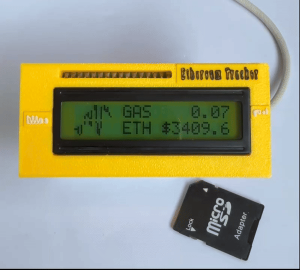
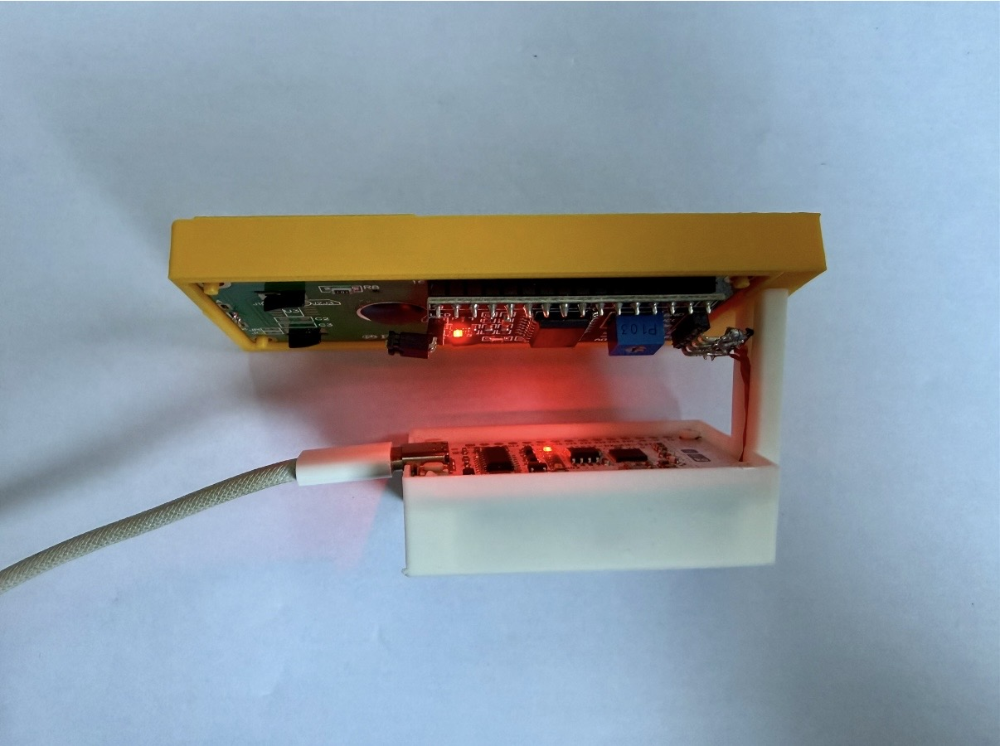
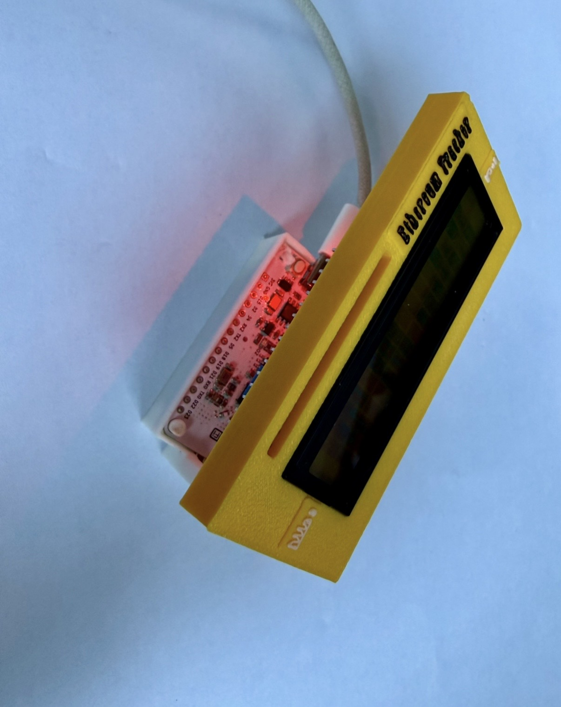

# CryptoTag

A simple crypto price tag powered by an ESP32. It fetches real-time cryptocurrency data from public APIs and displays it on a 16x2 I2C LCD.

<table width="500" height="500">
    <tr>
        <td colspan="2"></td>
    </tr>
    <tr>
        <td></td>
        <td></td>
    </tr>
</table>

## Features

* **Real-time Data**: Fetches and displays:
  * Ethereum (ETH) price from Binance.
  * Suggested Ethereum network gas fees from Etherscan.
* **K-Line Chart**: Renders a simple price trend chart for ETH/USDT using the LCD's custom character memory.
* **Easy Wi-Fi Setup**: Utilizes the `esp-wifi-connect` component to create a captive portal for initial Wi-Fi configuration. No hardcoded credentials needed.
* **LCD Display**: Information is clearly presented on a standard 1602 I2C LCD.

## Hardware Requirements

* An ESP32 development board.
* A 16x2 I2C LCD module.
* Jumper wires.

### Wiring

Connect the I2C LCD to your ESP32 as follows. The default pins are configured in `main/config.h`.

| ESP32 Pin | LCD Pin |
| :-------: | :-----: |
|    GND    |   GND   |
|    VCC    |   VCC   |
|  GPIO 21  |   SDA   |
|  GPIO 22  |   SCL   |

## Software & Dependencies

* ESP-IDF (v5.x is recommended).
* cJSON: For parsing JSON data from API responses.
* esp-wifi-connect: For easy Wi-Fi configuration via a web portal.
* A custom I2C LCD driver (included in the `components` directory).

## Configuration

1. **API Keys**:
    To fetch gas fees, you need an API key from Etherscan.
    Once you have the key, create a file named `main/config.h` and add the following line:

    ```c
    #pragma once
    
    #define ETHERSCAN_API_KEY "YOUR_ETHERSCAN_API_KEY"
    
    // I2C Configuration for LCD
    #define I2C_MASTER_SCL_IO 22
    #define I2C_MASTER_SDA_IO 21
    #define I2C_MASTER_NUM I2C_NUM_0
    #define I2C_MASTER_FREQ_HZ 100000
    ```

2. **Wi-Fi Setup**:
    On the first boot (or if it can't connect to a known network), the device will create a Wi-Fi Access Point with an SSID similar to `CryptoTag-XXXXXX`.
    * Connect to this network with your phone or computer.
    * A captive portal should automatically open in your browser. If not, navigate to `http://192.168.4.1`.
    * Select your home Wi-Fi network, enter the password, and save.
    * The device will then connect to your network and begin fetching data.

## How to Build and Flash

1. **Clone the repository:**

    ```sh
    git clone https://github.com/jayden-sudo/CryptoTag.git
    cd CryptoTag
    ```

2. **Set up ESP-IDF:**
    Make sure you have the ESP-IDF environment configured.

    ```sh
    . $IDF_PATH/export.sh
    ```

3. **Set the target chip:**

    ```sh
    idf.py set-target esp32
    ```

4. **Build, Flash, and Monitor:**
    Connect your ESP32 board and run:

    ```sh
    idf.py build flash monitor
    ```

## How It Works

1. **Initialization**: The device initializes the I2C bus and the LCD screen.
2. **Wi-Fi Connection**: It uses `wifi_connect` to establish an internet connection. If no credentials are stored, it starts the configuration portal.
3. **Data Fetching**: In the main loop, it periodically sends HTTP GET requests to the Binance and Etherscan APIs.
    * `https://api.binance.com/api/v3/klines?symbol=ETHUSDT...` for price history.
    * `https://api.etherscan.io/api?module=gastracker...` for gas fees.
4. **Parsing & Display**: The JSON responses are parsed using `cJSON`. The extracted price and gas fee are displayed on the LCD. The price history is used to calculate and render the K-line chart.
5. **K-Line Rendering**: The K-line is drawn by creating custom characters (5x8 pixels each) and mapping the price data onto an 8-character (4x2) grid on the LCD. The most recent price point blinks to indicate real-time activity.
